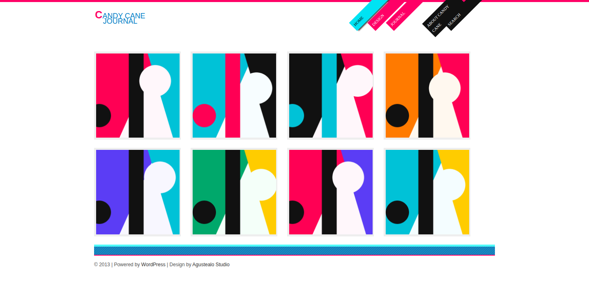
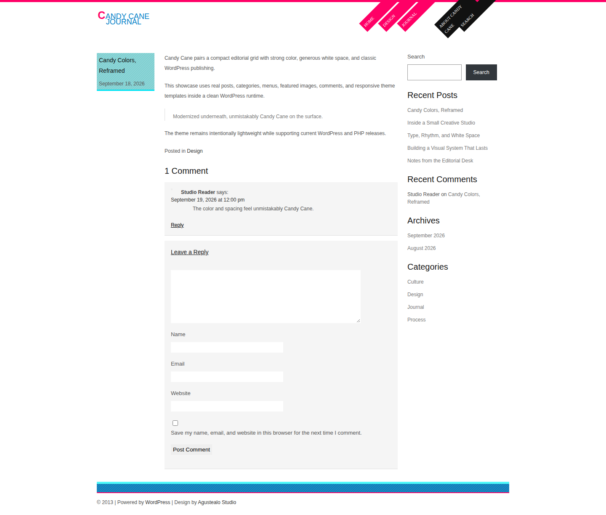
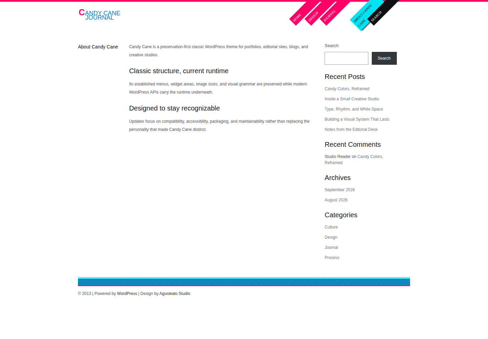
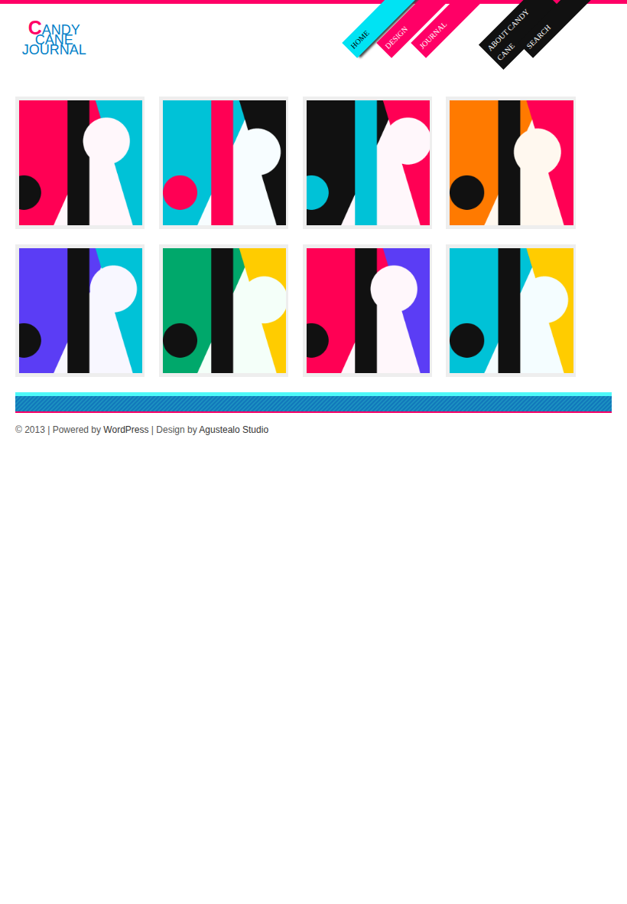
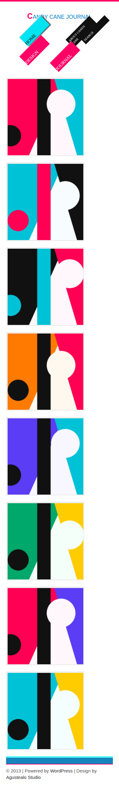
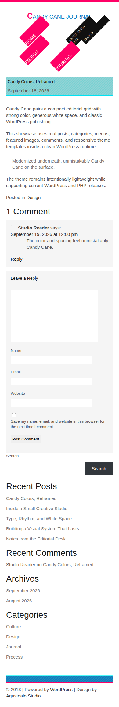
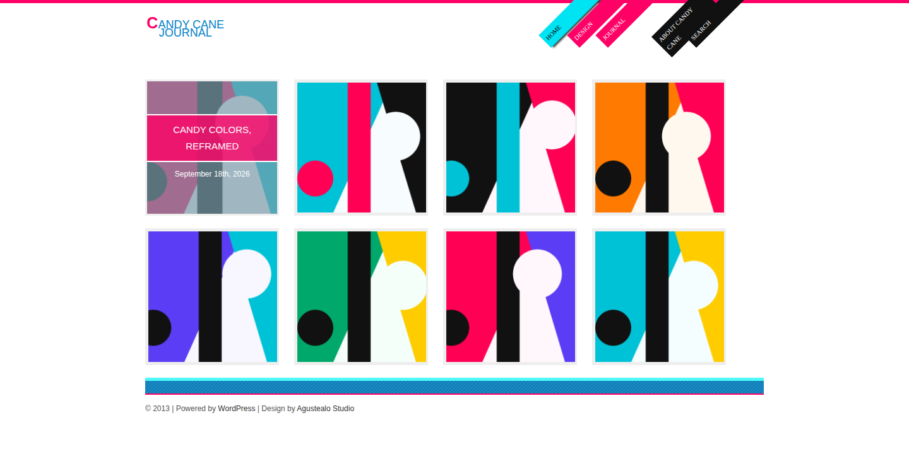

# Candy Cane visual showcase

These are real Candy Cane browser captures from the deterministic Docs Showcase runtime. The fixture is a clean WordPress installation populated with editorial content, categories, menus, comments, featured images and an About page. Artwork is generated deterministically inside the test runtime, so the gallery has no external image dependency.

## Desktop home

The primary showcase view demonstrates Candy Cane's familiar image-led home grid, dual navigation, bright post-card treatment and footer structure at a 1440px desktop viewport.

## Editorial single post

Shows the classic single-post hierarchy, featured image, typography, article content, navigation and comment presentation on a realistic editorial entry.

## Page and sidebar

Shows a standard page using the preserved Candy Cane content column and `right_sidebar` widget region.

## Tablet home

Demonstrates the preserved home-card system adapting to an 820px tablet viewport.

## Mobile home

Shows the compact home experience at 390px, including the historically familiar stacked card behavior.

## Mobile single post

Demonstrates the editorial template and content flow at the same compact viewport.

## Keyboard-visible card overlay

The image-card treatment remains visually familiar while also exposing its title overlay to keyboard focus. This capture is generated only after Playwright verifies the overlay opacity reaches the expected visible state.

## Provenance

The source of truth is `tests/docs-showcase.sh` plus `tests/browser/docs-showcase.mjs`. The `Docs Showcase` workflow regenerates these files with pinned browser tooling and verifies the committed `master` images remain current. See `MANIFEST.md` for the full documentation contract.
